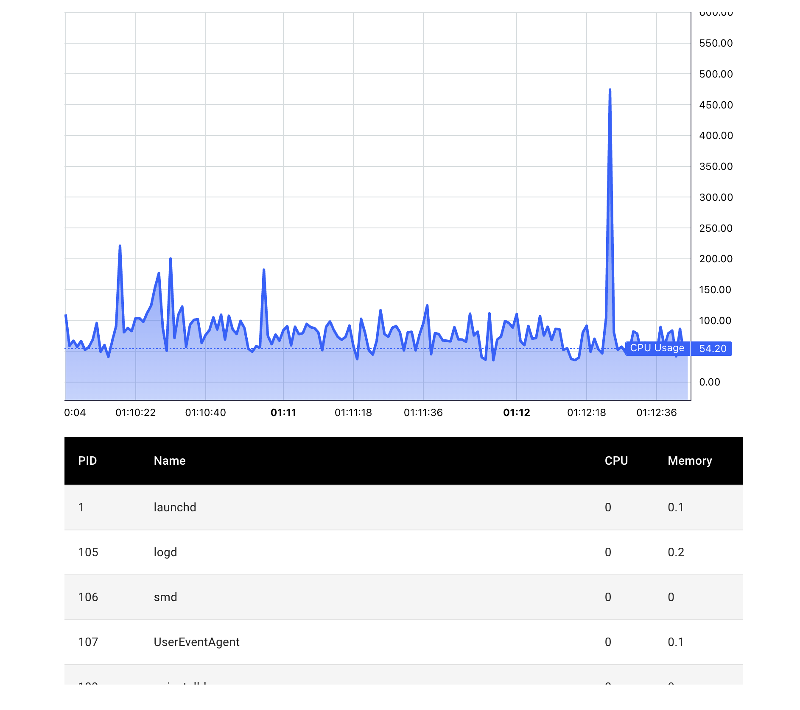

# Electron Memory Profiler

This project is a simple memory profiling and visualization tool written entirely
in JavaScript. The frontend is a ReactJS/Electron desktop app and the backend is a simple NodeJS websocket server. 

## Requirements

Node 18.16.0

## Usage

1. open project `cd electron-memory-profiler`
2. install node modules `npm i`
3. run desktop app and Node server `npm run dev`
 

## License

Copyright (c) Randy Lopez

Licensed under the Apache License, Version 2.0 (the "License");
you may not use this file except in compliance with the License.
You may obtain a copy of the License at

   http://www.apache.org/licenses/LICENSE-2.0

Unless required by applicable law or agreed to in writing, software
distributed under the License is distributed on an "AS IS" BASIS,
WITHOUT WARRANTIES OR CONDITIONS OF ANY KIND, either express or implied.
See the License for the specific language governing permissions and
limitations under the License.